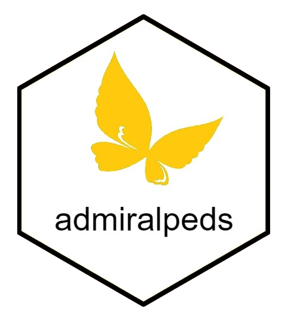

```{r setup, include=FALSE}
knitr::opts_chunk$set(echo = TRUE)
link <- function(text, url) {
  return(
    paste0(
      "[", text, "]",
      "(", url, ")"
    )
  )
}
dyn_link <- function(text,
                     base_url,
                     relative_url = "",
                     # Change to TRUE when admiral adopts multiversion docs
                     is_multiversion = FALSE,
                     multiversion_default_ref = "main") {
  url <- paste(base_url, relative_url, sep = "/")
  if (is_multiversion) {
    url <- paste(
      base_url,
      Sys.getenv("BRANCH_NAME", multiversion_default_ref),
      relative_url,
      sep = "/"
    )
  }
  return(link(text, url))
}

# Other variables
admiral_homepage <- "https://pharmaverse.github.io/admiral"
admiraldev_homepage <- "https://pharmaverse.github.io/admiraldev"
admiralci_homepage <- "https://pharmaverse.github.io/admiralci"
```

<!-- Please do not edit the README.md file as it is auto-generated after PR merges. Only edit the README.Rmd file -->
<!-- The purpose of this is to enable dynamic links using dyn_link function above to access devel/main admiral homepage respectively -->
<!-- To test this in your feature branch use code: rmarkdown::render("README.Rmd", output_format ="md_document") -->

# admiral package extension Template 

<!-- badges: start -->
[](https://pharmaverse.org)
[](https://CRAN.R-project.org/package=admiral)
[](https://github.com/pharmaverse/admiraltemplate/actions/workflows/code-coverage.yml)
<!-- badges: end -->

## Table of Contents

- `r link("Extension Expectations", "#extension-expectations")`
- `r link("What is included in the template", "#what-is-included-in-the-template")`
- `r link("Package Extension Guidance", "#package-extension-guidance")`
- `r link("Quick Start Guide for Template", "#quick-start-guide-for-template")`

## Extension Expectations 

To be included as an `{admiral}` package extension we expect developers to adhere to the following standards:

* `r dyn_link("Code of Conduct", admiral_homepage, "CODE_OF_CONDUCT.html")`
* `r dyn_link("Manifesto", admiral_homepage, "index.html?q=manifest#admiral-manifesto")`
* `r dyn_link("Programming Strategy", admiraldev_homepage, "articles/programming_strategy.html")`
* `r dyn_link("Development Process", admiraldev_homepage, "articles/development_process.html")`
* Follow consistent workflow checks
* A CRAN Release means 90% or greater test coverage

We have developed this repository template in order to reduce the burden on developers to follow these standards. This template will also help to harmonize the `{admiral}` family of R packages, to ensure a consistent user experience and ease of installing and adopting all the packages. With this in mind, we expect the same core package dependencies and versions as used for `{admiral}`.

## What is included in the template

The repository template includes the following:

*  License file (Apache 2.0 - but company co-developers need to be added to copyright section)
*  Required folders (R; test; templates; vignettes; renv; etc)
*  Set-up files (DESCRIPTION; NAMESPACE; renv.lock; etc)
*  Issue Templates (Bug Template; Feature Request; Documentation Request/Update; Onboarding)
*  Pull Request Template
*  Workflow actions (a selection of generic and specific CI/CD auto-checks)
*  Package badges (Test coverage; etc)
*  Branch protection rules

## Package Extension Guidance

For detailed information regarding the ethos of `{admiral}` package extensions and how to decide if you should set your own one up, please see our [Package Extension Guidance](https://pharmaverse.github.io/admiraldev/main/articles/package_extensions.html). You will also find details about team setup, suggested workflow and lessons learned from past package extensions.

## Quick Start Guide for Template 

Please thoroughly read the Package Extension Guidance above.  The intention of the Quick Start is to just get the template code into a new repo and check that the package works in your environment.  Please contact us via slack if any issues arise.

1.  Click the Green `Use this Template` Button.
1.  Change owner to `pharmaverse` and enter your repository name
1.  Create `devel` and `patch` branches.  These will be important later for workflows!
1.  Once repo has been created click Green Code button and download the repo using `https` or `ssh`
1.  Run `renv::restore()` - you will see a prompt and this will take a few minutes
     - This will ensure that your development environment for your extension package is synced with other admiral packages
1.  Update/Remove the following files to use your extension name:
    - `DESCRIPTION` File - Name, Authors
    - `admiraltemplate.Rproj`
    - `testthat.R`
    - `News.md`
1.  Run `devtools::load_all()` and resolve issues
1.  Run `devtools::document()` and resolve issues
1.  Run `pkgdown::build_site()`
    -  Reach out to slack for help with creating a hex sticker/logo to replace pharmaverse logo
1.  *Recommended*: Review the `r dyn_link("documentation on the CI/CD workflows", admiralci_homepage, "#what-these-workflows-do")` for information about how to reuse the workflows from this template. Pay special attention to the section on creating the `badges` orphan branch in `r dyn_link("this section", admiralci_homepage, "#code-coverage")`.
1.  Test out a dummy branch and do a Pull Request to ensure CI/CD works.
1.  Any clearly dummy files like `R/my_first_fcn.R` or `inst/templates/ad_adxx.R` can be updated or removed.
1.  Set up [branch protections rules](https://docs.github.com/en/repositories/configuring-branches-and-merges-in-your-repository/defining-the-mergeability-of-pull-requests/managing-a-branch-protection-rule)
for `main`, `devel`, and optionally for `pre-release` and `test` depending on your branching strategy.
1.  Set up and assign admin and write rights in Settings/Collaborators for members of the repository - using a GitHub team for all developers.
1.  Change badges and hex image in `README.Rmd` to your package.
